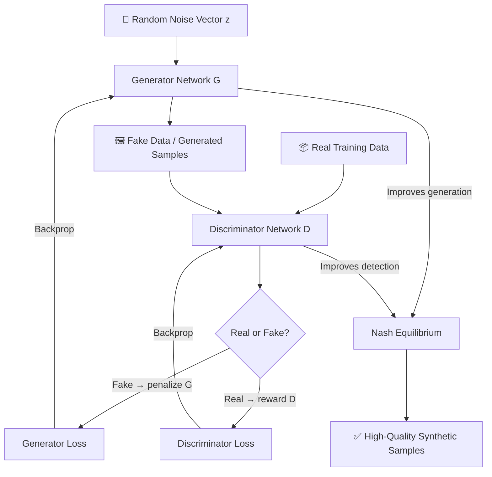

<div align="center">


[](https://python.org)
[](https://pytorch.org)
[](LICENSE)
[](https://github.com/Shadhai/GAN-Generative-Adversarial-Network-)
[](https://jupyter.org)

<br/>

**A clean, modular GAN implementation — a powerful alternative to keras-gans and PyTorch-GAN repos — built to generate high-quality synthetic data using adversarial training.**

<br/>

[](#-table-of-contents)
[](#-quick-start)
[](#-contributing)

</div>

---

## 📋 Table of Contents

- [🎯 Purpose & Philosophy](#-purpose--philosophy)
- [🏗️ Architecture Diagram](#️-architecture-diagram)
- [✨ Features](#-features)
- [🛠️ Tech Stack](#️-tech-stack)
- [🚀 Quick Start](#-quick-start)
- [⚙️ Configuration](#️-configuration)
- [🧩 Model Reference](#-model-reference)
- [🎨 Use Cases](#-use-cases)
- [📁 Project Structure](#-project-structure)
- [🐳 Docker Deployment](#-docker-deployment)
- [🧪 Testing](#-testing)
- [🔧 Troubleshooting](#-troubleshooting)
- [🗺️ Roadmap](#️-roadmap)
- [🤝 Contributing](#-contributing)
- [⭐ Star History](#-star-history)

---

## 🎯 Purpose & Philosophy

Generative Adversarial Networks (GANs) represent one of the most powerful paradigms in modern deep learning — two neural networks locked in an adversarial game that produces strikingly realistic synthetic data. This repository provides a **clean, well-documented, and extensible GAN framework** designed for both learning and production experimentation.

**Four Core Principles:**

| Principle | Description |
|:---|:---|
| 🧱 **Modularity** | Generator and Discriminator are fully decoupled for easy swapping and experimentation |
| 📚 **Clarity** | Every layer and training step is documented with comments and visual intuition |
| ⚡ **Performance** | Optimized training loops with gradient penalty and batch normalization support |
| 🔁 **Reproducibility** | Seed management and config files ensure consistent, shareable experiments |

---

## 🏗️ Architecture Diagram



---

## ✨ Features

| Feature | Status | Description |
|:---|:---:|:---|
| Vanilla GAN | ✅ | Classic Ian Goodfellow (2014) implementation |
| DCGAN | ✅ | Deep Convolutional GAN for image generation |
| Conditional GAN (cGAN) | ✅ | Class-conditioned sample generation |
| Wasserstein GAN (WGAN) | ✅ | Stable training with Earth Mover's Distance |
| Gradient Penalty (WGAN-GP) | ✅ | Improved Lipschitz constraint enforcement |
| Training Visualization | ✅ | Real-time loss curves and sample grids |
| Checkpoint Saving | ✅ | Save & resume training from any epoch |
| Custom Dataset Support | ✅ | Plug in any image or tabular dataset |
| Evaluation Metrics (FID) | 🚧 | Fréchet Inception Distance scoring |
| Diffusion Hybrid | 🚧 | Coming in v2.0 |

---

## 🛠️ Tech Stack

| Layer | Technology |
|:---|:---|
| **Language** | Python 3.8+ |
| **Deep Learning** | PyTorch / TorchVision |
| **Notebook Interface** | Jupyter Notebook |
| **Data Handling** | NumPy, Pandas |
| **Visualization** | Matplotlib, TensorBoard |
| **Image Processing** | Pillow (PIL), OpenCV |
| **Experiment Tracking** | TensorBoard / Weights & Biases (optional) |
| **Containerization** | Docker |

---

## 🚀 Quick Start

### Step 1 — Clone

```bash
git clone https://github.com/Shadhai/GAN-Generative-Adversarial-Network-.git
cd GAN-Generative-Adversarial-Network-
```

### Step 2 — Configure

```bash
pip install -r requirements.txt
cp config/config.example.yaml config/config.yaml
# Edit config.yaml to set your dataset path and hyperparameters
```

### Step 3 — Run

```bash
# Train the GAN
python train.py --config config/config.yaml

# Generate samples from a trained checkpoint
python generate.py --checkpoint checkpoints/epoch_100.pt --num_samples 64
```

---

## ⚙️ Configuration

```env
# Model Settings
LATENT_DIM=100
IMAGE_SIZE=64
NUM_CHANNELS=3

# Training Hyperparameters
BATCH_SIZE=64
LEARNING_RATE_G=0.0002
LEARNING_RATE_D=0.0002
BETA1=0.5
BETA2=0.999
NUM_EPOCHS=200

# Dataset
DATASET_PATH=./data/
DATASET_TYPE=MNIST       # Options: MNIST, CIFAR10, CelebA, custom

# Checkpointing
SAVE_INTERVAL=10
CHECKPOINT_DIR=./checkpoints/

# Logging
LOG_DIR=./logs/
SAMPLE_DIR=./samples/
TENSORBOARD=true
```

---

## 🧩 Model Reference

### Generator Architecture

| Layer | Type | Output Shape | Notes |
|:---|:---|:---|:---|
| Input | Linear | `(B, 256)` | Latent noise vector z |
| FC1 | Linear + BN + ReLU | `(B, 512)` | Fully connected block |
| FC2 | Linear + BN + ReLU | `(B, 1024)` | Upsampling in feature space |
| ConvT1 | ConvTranspose2d | `(B, 128, 8, 8)` | Spatial upsampling begins |
| ConvT2 | ConvTranspose2d | `(B, 64, 16, 16)` | Mid-resolution features |
| ConvT3 | ConvTranspose2d | `(B, 32, 32, 32)` | Higher resolution |
| Output | ConvTranspose2d + Tanh | `(B, C, 64, 64)` | Final image in [-1, 1] |

### Discriminator Architecture

| Layer | Type | Output Shape | Notes |
|:---|:---|:---|:---|
| Input | Conv2d + LeakyReLU | `(B, 64, 32, 32)` | No batch norm in first layer |
| Conv1 | Conv2d + BN + LReLU | `(B, 128, 16, 16)` | Downsampling |
| Conv2 | Conv2d + BN + LReLU | `(B, 256, 8, 8)` | Feature extraction |
| Conv3 | Conv2d + BN + LReLU | `(B, 512, 4, 4)` | Deep features |
| Output | Linear + Sigmoid | `(B, 1)` | Real/fake probability |

### Training Loop API

| Method | Description |
|:---|:---|
| `train_step(real_batch)` | Single adversarial training iteration |
| `compute_generator_loss(fake_output)` | BCE or Wasserstein generator objective |
| `compute_discriminator_loss(real, fake)` | Discriminator loss with optional gradient penalty |
| `save_checkpoint(epoch, path)` | Persist model weights and optimizer states |
| `load_checkpoint(path)` | Resume from a saved checkpoint |
| `generate_samples(num, noise)` | Produce synthetic samples from generator |

---

## 🎨 Use Cases

| Scenario | Description | GAN Variant |
|:---|:---|:---|
| 🖼️ **Image Synthesis** | Generate photorealistic faces, scenes, or objects from noise | DCGAN / StyleGAN-inspired |
| 🔢 **Data Augmentation** | Expand small datasets for downstream ML models | Conditional GAN |
| 🎭 **Domain Transfer** | Transform images from one style to another (sketch → photo) | CycleGAN |
| 🧬 **Anomaly Detection** | Train on normal data; flag reconstructions with high error | Vanilla GAN / WGAN |

---

## 📁 Project Structure

```
GAN-Generative-Adversarial-Network-/
│
├── 📂 models/
│   ├── generator.py          # Generator network definition
│   ├── discriminator.py      # Discriminator network definition
│   └── losses.py             # Loss functions (BCE, Wasserstein, GP)
│
├── 📂 data/
│   ├── dataset.py            # Custom dataset loader
│   └── transforms.py         # Image preprocessing pipelines
│
├── 📂 config/
│   ├── config.example.yaml   # Template configuration
│   └── config.yaml           # Your local config (gitignored)
│
├── 📂 utils/
│   ├── visualization.py      # Sample grids, loss plots
│   ├── metrics.py            # FID, IS score computation
│   └── helpers.py            # Seed setting, checkpoint utils
│
├── 📂 checkpoints/           # Saved model weights
├── 📂 samples/               # Generated image samples
├── 📂 logs/                  # TensorBoard logs
│
├── 🗒️ notebooks/
│   └── GAN_Demo.ipynb        # Interactive training walkthrough
│
├── train.py                  # Main training script
├── generate.py               # Sample generation script
├── evaluate.py               # Compute FID/IS metrics
├── requirements.txt
└── README.md
```

---

## 🐳 Docker Deployment

```bash
# Build the image
docker build -t gan-framework .

# Train inside container (mount your dataset)
docker run --gpus all \
  -v $(pwd)/data:/app/data \
  -v $(pwd)/checkpoints:/app/checkpoints \
  gan-framework python train.py --config config/config.yaml

# Or use Docker Compose
docker-compose up --build
```

**docker-compose.yml excerpt:**
```yaml
services:
  gan:
    build: .
    volumes:
      - ./data:/app/data
      - ./checkpoints:/app/checkpoints
      - ./samples:/app/samples
    deploy:
      resources:
        reservations:
          devices:
            - driver: nvidia
              count: 1
              capabilities: [gpu]
```

---

## 🧪 Testing

```bash
# Run all unit tests
python -m pytest tests/ -v

# Test generator output shapes
python -m pytest tests/test_generator.py -v

# Test discriminator forward pass
python -m pytest tests/test_discriminator.py -v

# Run a quick smoke-test training run (5 epochs)
python train.py --config config/config.yaml --epochs 5 --smoke-test

# Evaluate FID score on saved checkpoint
python evaluate.py --checkpoint checkpoints/epoch_100.pt --dataset ./data/
```

---

## 🔧 Troubleshooting

| Symptom | Likely Cause | Fix |
|:---|:---|:---|
| Generator loss diverges to infinity | Learning rate too high for G | Reduce `LEARNING_RATE_G` by 10x |
| Mode collapse (all samples look identical) | D overpowers G early in training | Use WGAN-GP; add noise to D inputs |
| Checkerboard artifacts in images | ConvTranspose2d stride issues | Replace with Upsample + Conv2d |
| CUDA out of memory | Batch size too large | Reduce `BATCH_SIZE`; use gradient checkpointing |
| D loss always ~0, G loss stuck | Discriminator is too strong | Lower D learning rate or add dropout to D |
| Generated images are blurry | Latent dim too small | Increase `LATENT_DIM` to 256 or 512 |
| Training unstable / oscillating loss | No gradient clipping | Add `torch.nn.utils.clip_grad_norm_` |

---

## 🗺️ Roadmap

- [x] Vanilla GAN (Goodfellow 2014)
- [x] DCGAN with convolutional layers
- [x] Conditional GAN (class conditioning)
- [x] WGAN with weight clipping
- [x] WGAN-GP with gradient penalty
- [x] TensorBoard training visualization
- [x] Checkpoint save/resume
- [ ] FID & Inception Score evaluation
- [ ] Progressive Growing GAN (ProGAN)
- [ ] StyleGAN-inspired architecture
- [ ] Diffusion-GAN hybrid
- [ ] Web demo with Gradio/Streamlit

---

## 🤝 Contributing

Contributions are warmly welcome! Here's how to get started:

```bash
# Step 1 — Fork the repository on GitHub

# Step 2 — Clone your fork
git clone https://github.com/YOUR_USERNAME/GAN-Generative-Adversarial-Network-.git

# Step 3 — Create a feature branch
git checkout -b feature/my-new-gan-variant

# Step 4 — Make your changes and run tests
python -m pytest tests/ -v

# Step 5 — Commit with a descriptive message
git commit -m "feat: add StyleGAN-inspired progressive growing"

# Step 6 — Push and open a Pull Request
git push origin feature/my-new-gan-variant
```

Please follow the existing code style and include tests for any new model variants.

---

## ⭐ Star History

[](https://star-history.com/#Shadhai/GAN-Generative-Adversarial-Network-&Date)

---

<div align="center">

**Built with ❤️ by [Shadhai](https://github.com/Shadhai)**

*If this project helped you understand GANs, please ⭐ star the repo — it motivates further development!*


</div>
